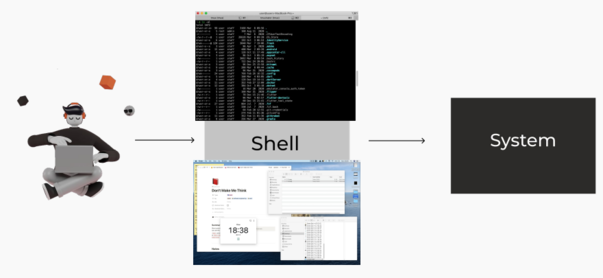
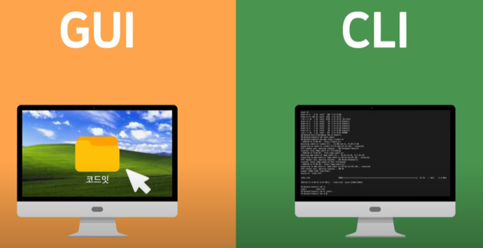
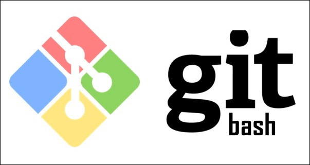
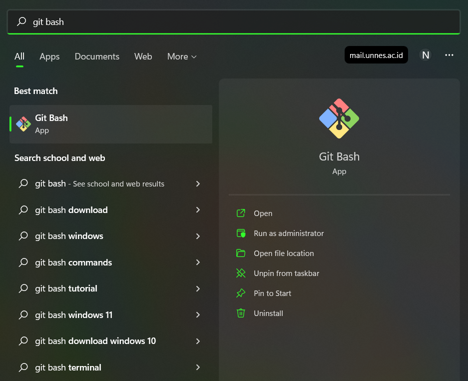
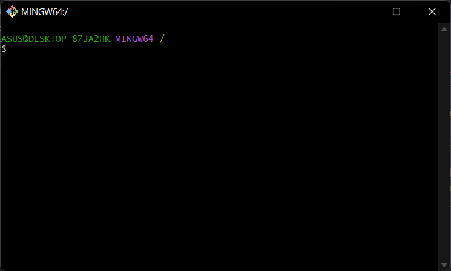
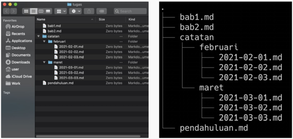
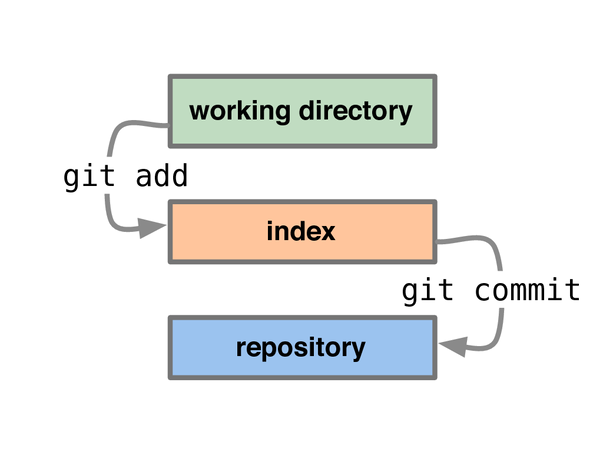
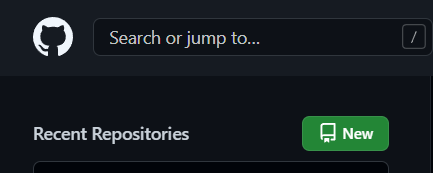

# Writing and Presentation Test Week 1

<!-- --- -->

## Modul 1 - Unix Command Line

Secara umum, agar pengguna atau **_user_** bisa berinteraksi dengan sistem operasi komputer, ada program yang disebut dengan **_shell_**. Lalu, apa itu shell ? Ada berapa macamnya ? dan bagaimana cara mengaksesnya ?

1. **Tentang Shell**

   - Shell adalah program yang digunakan untuk berkomunikasi antara pengguna dengan sistem operasi komputer.
     
   - Shell dibagi menjadi dua berdasarkan tampilan _interface_-nya, yaitu

     1. GUI (_Graphical User Interface_) adalah tampilan antarmuka berbentuk grafis atau objek yang merepresentasikan perintah untuk menampilkan sesuatu. Contoh : File Explorer di Windows.
     2. CLI (_Command Line Interface_) adalah tampilan antarmuka berupa _terminal_ yang berbasis baris teks untuk memberikan perintah menjalankan suatu program, mengelola file, dan berinteraksi dengan komputer. Contoh : sh, bash, zsh, cmd.
        

2. **Cara untuk mengakses CLI dan menggunakan terminal**
   - Untuk mengakses CLI, kita bisa menggunakan Terminal Emulator seperti CMD, Windows Powershell, Git Bash, dan lain - lain. Agar lebih mudah kedepannya, di sini kita akan menggunakan **Git Bash**.  
     
   - Git bisa di-_download_ melalui situs resminya [di sini](https://git-scm.com/downloads). Tutorial instalasi juga bisa ditemukan di internet. Ada banyak sekali website dan video di Youtube yang membahasnya.
   - Setelah di-_download_ dan _install_, buka Git Bash dengan mengetikkan `git bash` di kotak pencarian windows.  
     
   - Selanjutnya akan terbuka jendela baru yang merupakan jendela dari Git Bash. Sampai proses ini kita sudah siap untuk menggunkan Git Bash.  
     
3. **File System**
   - _File system_ adalah sebuah cara untuk mengatur bagaimana data disimpan di dalam sebuah sistem.
   - Pada sistem operasi Windows dan UNIX-like, file dan direktori disusun menggunakan struktur yang bentuknya seperti _tree_.
     
   - Biasanya, _root directory_ adalah direktori yang berada di tingkat paling atas.
   - Di OS Windows, _root_-nya adalah Local disk C: atau D:\. Sementara itu, untuk tampilan CLI, _root directory_ adalah tanda titik (`.`).
4. **Command untuk Navigasi**  
   `pwd` - melihat nama direktori kita berada saat ini.

   `ls` - melihat isi dari direktori.

   `cd` - berpindah ke direktori lain.

5. **Command untuk membuat file dan direktori**  
   `touch` - membuat sebuah file.

   `mkdir` - membuat sebuah direktori/folder.

6. **Command untuk melihat isi file**  
   `cat` - melihat isi sebuah file.

   `head` - melihat beberapa baris awal dari sebuah file.

   `tail` - melihat beberapa baris akhir dari sebuah file.

7. **Command untuk menyalin, memindah, me-_rename_, dan menghapus file dan direktori**  
   `cp` - menyalin file.

   `cp -R` - menyalin direktori.

   `mv` - memindahkan file ke direktori lain.

   `mv -R` - memindahkan direktori.

   `rm` - menghapus file.

   `rm -R` atau `rm -d` - menghapus direktori

## Modul 2 - Git & Github Dasar

1. **Tentang Git dan Github**
   - Git adalah _tools_ yang digunakan dalam memversikan program atau disebut dengan _Version Control System_.
   - Git dapat melacak setiap perubahan yang terjadi pada suatu file atau direktori, termasuk siapa yang mengubahnya.
   - Github adalah sebuah website yang memberikan layanan cloud untuk mengelola dan menyimpan kode suatu project.
   - Local repository adalah istilah untuk direktori penyimpanan yang masih ada di lokal komputer kita.
   - Remote repository adalah istilah untuk direktori penyimpanan yang berada di Github.
   - Git dan Github adalah tools yang wajib digunakan khususnya oleh programmer karena bisa bekerja sama dalam sebuah tim tanpa menunggu rekan satu tim menyelesaikan suatu program terlebih dahulu. Seperti pepatah :
     > Sepandai apapun seorang programmer, tidak akan bisa bekerja sendirian selamanya
2. **Setup Awal Git**

   - Konfigurasi Git  
     `git config --global user.name "Nunung Ali Maulana"` untuk menambahkan _username_.

     `git config --global user.email nunungalimaulana@students.unnes.ac.id` untuk menambahkan email.  
     \* Pastikan email yang ditambahkan sama dengan email yang didaftarkan ke Github.
     `git config --list` untuk mengecek apakah setup berhasil.

   - 3 stage di Git
     

   - Membuat repository Git
     Buat sebuah folder yang akan menyimpan projek kita. Klik kanan dan pilih `Git Bash Here` untuk membuka Git Bash.  
     `git init` untuk membuat repository git dengan nama **.git**.
   - `git status` untuk melihat ada tidaknya perubahan pada direktori projek.
   - `git add <nama file>` atau `git add .` untuk menambahkan perubahan(_tracking_) dari **Working Directory** ke **Staging Area** pada Git.
   - `git commit -m "pesan commit"` untuk menyimpan perubahan ke **Git Repository**.
   - `git log` untuk melihat catatan commit yang pernah dilakukan.
   - `git log --oneline` untuk melihat catatan commit dalam satu baris.

3. **Push ke Github**
   - Membuat repository di Github
     1. Buka situs Github di <https://github.com/>. Pastikan untuk masuk ke Github dengan _login_ atau _sign up_ jika belum memilik akun.
     2. Setelah masuk, pada bagian kiri klik _new_ untuk membuat repository baru.  
        
     3. Isi nama repository dan deskripsi singkatnya, pilih visibilty(public/private), dan terakhir klik **Create repository**
   - `git branch -M main` untuk mengubah branch master menjadi branch main.
   - `git remote add origin <link>` untuk menghubungkan _local repository_ dan _github repository_.
   - `git push -u origin main` untuk melakukan push dari _local reposiroty_ ke _github repository_.
4. **Cloning Github ke local**
   - Melakukan clone repository dari Github ke local menggunakan command `git clone <link repository>`

## Modul 3 - HTML Dasar

- HTML adalah singkatan dari Hipertext Markup Language.
- HTML bukanlah bahasa pemrograman. Namun, berfungsi untuk membuat kerangka dari website dan menampilkan konten didalamnya.
- Tools utama untuk menggunakan HTML, yaitu :
  1. Browser, seperti Google Chrome, Mozilla Firefox, Opera, Safari.
  2. Code Editor, seperti Visual Studio Code, Sublime Text, Vim, dll.
- Untuk menjalankan file HTML secara manual dapat dengan membuka langsung file HTML via Google Chrome
- Untuk menjalankan file HTML secara otomatis dapat menggunakan ekstensi _live server_ yang ada di VS Code.
- Beberapa ekstensi untuk mempermudah dalam membuat isi file HTML di VS Code diantaranya :
  1. Live server
  2. Prettier
  3. Auto CLose Tag
  4. Auto Rename Tag
- HTML Structure :
  ```html
  <!DOCTYPE html>
  <html lang="en">
    <head>
      <meta charset="UTF-8" />
      <meta name="viewport" content="width=device-width, initial-scale=1.0" />
      <title>Website Nunung</title>
    </head>
    <body>
      <h1 class="header">Halo ! Ini adalah Website pertamaku</h1>
      <p>Namaku Nunung Ali Maulana</p>
    </body>
  </html>
  ```
- HTML elements terdiri dari 3 bagian utama, yaitu opening tag, content, dan closing tag.
- HTML attributes adalah properti dari sebuah HTML element. Misalnya id, src, href, dll.
- HTML comment berfungsi untuk memberikan penjelasan maksud dari baris kode yang kita buat. Comment ini tidak akan dieksekusi oleh sistem. Cara membuatnya dengan `<!--(isi comment) -->`.
- Ada 2 jenis tag di HTMl, yaitu :  
  _single tag_(tidak memiliki tag penutup), seperti tag `<br/>`, ``,  
  _double tag_(memilik tag penutup), seperti tag `<h1> </h1>`, `<p> </p>`, `<b> </b>`.
- Tag populer yang sering digunakan di HTML diantaranya tag ``, `<video></video>`, `<table></table>`, `<form></form>`,dan lain lain.
- Semantic HTML adalah menggunakan dan menempatkan content sesuai dengan posisi dan kebutuhannya.

  ```html
  <body>
    <header>
      <h1>Website Nunung Ali Maulana</h1>
    </header>

    <nav>
      <a href="#">Home</a> | <a href="#">About</a> |
      <a href="#">Contact Us</a>
    </nav>

    <article>
      <h1>Halo ! Ini adalah website pertamaku</h1>
      <p>Saya Nunung Ali Maulana dari Universitas Negeri Semarang</p>
    </article>

    <footer>Copyright &copy; 2022 by nunungalimaulana_</footer>
  </body>
  ```

- Agar website yang sudah kita buat bisa diakses oleh orang lain melalui internet, maka harus dilakukan publish atau deploy ke sebuah layanan hosting. Ada layanan yang gratis dan juga berbayar. Untuk menggunakan layanan gratis, salah satunya dapat menggunakan sebuah situs bernama [Netlify](https://www.netlify.com/). Setelah mendaftar dan masuk ke menu _site_, kita dapat mengupload repository dari website kita yang ada di Github ke Netlify. Selanjutnya, setelah terdeploy, kita bisa mengubah nama domain melalui menu _setting_.

## Modul 4 - CSS Dasar

## Modul 5 - Algoritma

## Modul 6 - JavaScript Dasar

Peserta mampu memahami peran CSS pada web development
Peserta mampu memahami beberapa cara menyisipkan CSS ke dalam HTML
Peserta mampu memahami dan menggunakan sintaks dasar dari CSS
Peserta mampu menerapkan styling CSS pada sebuah halaman HTML
Peserta mampu memahami dan menggunakan metode responsive web design menggunakan CSS
Peserta mampu memahami dan menggunakan flexbox
