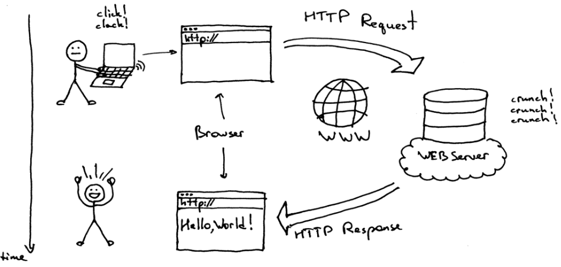
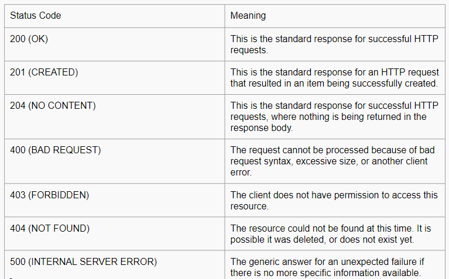

# Writing Test Week 5

## Web Server & Restful API

- Web server adalah penghubung yang menjembatani antara _request_ yang dikirim oleh _client server_ dan _response_ yang diberikan oleh _server side_.
- Web server terdiri dari 2 komponen penting, yaitu :
  - Hardware
  - Software
- Di sisi _hardware_, web server adalah komputer yang menyimpan _software_ web server dan file komponen situs web. Misalnya, dokumen HTML, gambar, CSS, dan file JavaScript.
- Di sisi _software_, web server mencakup beberapa bagian yang mengontrol bagaimana pengguna mengakses web dan file yang dihosting. Misalnya adalah HTTP Server.
- Server HTTP adalah perangkat lunak yang membaca URL (alamat web) dan HTTP protokol yang digunakan browser untuk menampilkan halaman web.
  
- Static Web Server terdiri dari komputer / _hardware_ dengan HTTP Server. Disebut statis karena server mengirimkan file yang dihosting apa adanya di browser.
- Dynamic Web Server terdiri dari server web statis dengan _software_ seperti _application server_ dan database. Disebut dinamis karena _application server_ memperbarui file yang dihosting sebelum menampilkan ke browser.

### Server Side Programming

- Web Server menunggu pesan permintaan klien, memprosesnya saat tiba, dan membalas browser web dengan pesan respons HTTP. Respons berisi baris status yang menunjukkan apakah permintaan berhasil atau tidak.
- Situs statis adalah situs yang mengembalikan konten hard-coded yang sama dari server setiap kali sumber daya tertentu diminta.
- Situs Dinamis adalah situs di mana beberapa konten respons dihasilkan secara dinamis, hanya bila diperlukan.
- Sebagian besar kode untuk mendukung situs web dinamis harus dijalankan di server. Membuat kode ini dikenal sebagai **Server Side Programming**.

### Perbedaan Situs Statis dan Dinamis

- Memiliki tujuan yang berbeda.
- Umumnya tidak menggunakan bahasa permrograman yang sama.
- Berjalan di _environtment_ sistem operasi yang berbeda.
- Apa yang bisa dilakukan di _Server Side ?_
  - Penyimpanan dan pengiriman informasi yang efisien
  - User Experience yang dikustomisasi
  - Akses terkontrol ke konten
  - Menyimpan informasi sesi atau status
  - Notifikasi dan komunikasi
  - Analisis data

### REST

- REST atau REpresentational State Transfer adalah arsitektur untuk menyediakan standar antara sistem komputer di web sehinggan memudahkan sistem untuk berkomunikasi satu sama lain.
- Sistem yang REST sering disebut dengan sistem RESTful yang dicirikan dengan memisahkan tugas di _client side_ dan _server side_.
- Dalam REST arsitektur, implementasi _client_ dan _server_ dapat dilakukan secara independen atau terpisah. Artinya bahwa kode di _client side_ bisa diubah kapanpun tanpa mempengaruhi _server side_ dan sebaliknya.
- Dengan menggunakan REST Interface, client yang berbeda memiliki _endpoint_ yang sama, melakukan aksi yang sama, dan menerima respons yang sama.

### Komunikasi antara Client dan Server

- Membuat Request  
  REST mengharuskan klien membuat permintaan ke server untuk mengambil atau mengubah data di server.
- HTTP VERBS  
  Ada 4 HTTP verbs dasar yang kita gunakan pada proses _request_ dengan sistem REST, yaitu :
  - GET - mengambil data tertentu (berdasarkan id) atau kumpulan data
  - POST - menambahkan atau membuat data baru
  - PUT - memperbarui data tertentu (berdasarkan id)
  - DELETE - menghapus data tertentu dengan id
- Headers and Accept Parameters
  - Di bagian header dari request, _client side_ mengirimkan jenis konten yang dapat diterima dari server.
  - Ini disebut dengan _Accept Fields_ dan ini memastikan bahwa server tidak mengirim data yang tidak dapat dipahami oleh _client_(MIME Types).
  - Jenis lain yang sering digunakan :
    > - image — image/png, image/jpeg, image/gif
    > - audio — audio/wav, audio/mpeg
    > - video — video/mp4, video/ogg
    > - application — application/json, application/pdf, application/xml, application/octet-stream
- Paths
  - Request harus berisi path ke _resource_ yang dituju. Pada RESTful APIs, paths harus dirancang untuk membantu _client_ mengetahui apa yang sedang terjadi.
- Mengirim Responses
  - Response Codes - Response dari _server_ berisi status kode untuk memberitahu _client_ tentang informasi keberhasilan operasi.
    
  - Untuk setiap HTTP Verbm ada pengecualian untuk statud kode yang harus direturn ketika sukses atau berhasil
  - GET - return 200(OK)
  - POST - return 201(CREATED)
  - PUT - return 200(OK)
  - DELETE - return 204(NO CONTENT)

## Intro Node Js

- Node.js adalah runtime environtment JavaScript yang berjalan di Engine V8 dan mengeksekusi kode JS di luar browser web.

### Node Js Arsitektur


- Single thread : Javascript menggunakan konsep single thread, yang berarti hanya memiliki satu tumpukan panggilan yang digunakan untuk menjalankan program.
- Javascript menggunakan call stack untuk melakukan manajemen single thread. Ketika terdapat perintah baru maka akan ditambahkan (push) dan akan dikeluarkan ketika perintahnya sudah selasai (pop).
- Dengan konsep arsitektur JS, JavaScript yang merupakan single thread bisa berjalan seperti multi thread.
- _event queue_ berguna sebagai penampung ketika ada perintah baru yang akan dieksekusi.
- Event loop akan memfasilitasi kondisi ini, dengan memerika terus menerus dan akan menambahkan antrian baru ke event queue ketika antrian kosong. Proses ini berjalan sampai semua perintah selesai dieksekusi.
- Server Side Scripting
  - Awalnya, JS merupakan bahasa pemrograman yang digunakan di FE Side. Untuk menampilkan hasilnya bisa menggunakan browser.
  - Namun, dengan Node Js, JavaScript bisa berjalan di server side menggunakan terminal.

### Instalasi Node Js

- Link download : [Download Node Js](https://nodejs.org/en/).
- Untuk proses instalasi, ada banyak tutorial di google dan youtube dengan proses yang hampir sama.
- Setelah proses instal selesai, untuk mengetes apakah berhasil terinstall, dapat menjalankan _command_ “node -v” untuk mengecek versi NodeJS yang terinstal.
- Command "npm -v" untuk mengecek versi dari NPM(node pacakge manager).
- Untuk menjalankan Node Js, di terminal bisa mengetikkan _command_ "node".

### Built-in Module Node JS

1. Console
   - Module bawaan JavaScript untuk menampilkan atau debug code secara interface.
   ```javascript
   console.log("Ini Console Module JS");
   ```
2. Process

   - Module untuk menampilkan dan mengontrol proses NodeJs yang sedang berjalan.

   ```javascript
   const process = require("process");
   const env = process.env;

   env.name = "Ali";
   console.log(env.name);
   ```

3. OS

   - Module untuk menyediakan informasi terkait sistem operasi komputer yang digunakan.

   ```javascript
   const os = require("os");
   console.log("Platform: " + os.platform());
   console.log("Acrhitecture: " + os.arch());
   ```

4. Util

   - Module untuk mendukung kebutuhan internal API.

   ```javascript
   const util = require("util");
   const debugLog = util.debuglog("foo");

   debugLog("Hi from foo [%d]", 123);
   ```

5. Events

   ```javascript
   const EventEmmitter = require("events");
   class MyEmitter extends EventEmmitter {}

   const myEmitter = new MyEmitter();
   myEmitter.on("event", () => {
     console.log("an event occured");
   });
   myEmitter.emit("event");
   ```

6. Errors
   - Module untuk mendefinisikan error dengan lebih informatif.
   ```javascript
   try {
     const m = 1;
     const n = m + z;
   } catch (err) {
     //Handle error here
   }
   ```
7. Buffer

   - Module untuk mengakses, mengelolam dan mengubah tipe data raw atau bytes.

   ```javascript
   import { buffer } from "buffer";
   const buf = Buffer.from("Hello world", "utf8");
   console.log(buf.toString("hex"));
   console.log(buf.toString("base64"));
   ```

8. FS
   - Module "file system" adalah module yang dapat membantu berinteraksi dengan file yang ada di luar code.
   ```javascript
   import { readFileSync } from "fs";
   readFileSync("<directory>");
   ```
9. Timers
   - Module yang diguanakan untuk melakukan scheduling atau mengatur waktu pemanggilan fungsi.
   ```javascript
   import { setTimeout } from "timers/promises";
   const res = await setTimeout(100, "result");
   console.log(res);
   ```

## Express Routing & Middleware

## Design Database with MySQL

## Normalisasi Database
