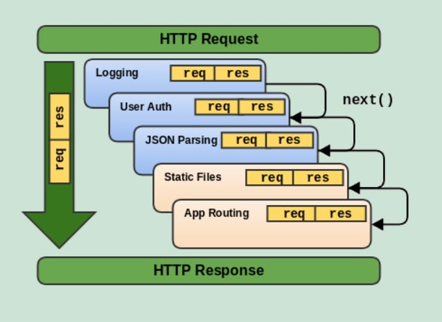

# Writing Test Week 5

## Web Server & Restful API

- Web server adalah penghubung yang menjembatani antara _request_ yang dikirim oleh _client server_ dan _response_ yang diberikan oleh _server side_.
- Web server terdiri dari 2 komponen penting, yaitu :
  - Hardware
  - Software
- Di sisi _hardware_, web server adalah komputer yang menyimpan _software_ web server dan file komponen situs web. Misalnya, dokumen HTML, gambar, CSS, dan file JavaScript.
- Di sisi _software_, web server mencakup beberapa bagian yang mengontrol bagaimana pengguna mengakses web dan file yang dihosting. Misalnya adalah HTTP Server.
- Server HTTP adalah perangkat lunak yang membaca URL (alamat web) dan HTTP protokol yang digunakan browser untuk menampilkan halaman web.
  
- Static Web Server terdiri dari komputer / _hardware_ dengan HTTP Server. Disebut statis karena server mengirimkan file yang dihosting apa adanya di browser.
- Dynamic Web Server terdiri dari server web statis dengan _software_ seperti _application server_ dan database. Disebut dinamis karena _application server_ memperbarui file yang dihosting sebelum menampilkan ke browser.

### Server Side Programming

- Web Server menunggu pesan permintaan klien, memprosesnya saat tiba, dan membalas browser web dengan pesan respons HTTP. Respons berisi baris status yang menunjukkan apakah permintaan berhasil atau tidak.
- Situs statis adalah situs yang mengembalikan konten hard-coded yang sama dari server setiap kali sumber daya tertentu diminta.
- Situs Dinamis adalah situs di mana beberapa konten respons dihasilkan secara dinamis, hanya bila diperlukan.
- Sebagian besar kode untuk mendukung situs web dinamis harus dijalankan di server. Membuat kode ini dikenal sebagai **Server Side Programming**.

### Perbedaan Situs Statis dan Dinamis

- Memiliki tujuan yang berbeda.
- Umumnya tidak menggunakan bahasa permrograman yang sama.
- Berjalan di _environtment_ sistem operasi yang berbeda.
- Apa yang bisa dilakukan di _Server Side ?_
  - Penyimpanan dan pengiriman informasi yang efisien
  - User Experience yang dikustomisasi
  - Akses terkontrol ke konten
  - Menyimpan informasi sesi atau status
  - Notifikasi dan komunikasi
  - Analisis data

### REST

- REST atau REpresentational State Transfer adalah arsitektur untuk menyediakan standar antara sistem komputer di web sehinggan memudahkan sistem untuk berkomunikasi satu sama lain.
- Sistem yang REST sering disebut dengan sistem RESTful yang dicirikan dengan memisahkan tugas di _client side_ dan _server side_.
- Dalam REST arsitektur, implementasi _client_ dan _server_ dapat dilakukan secara independen atau terpisah. Artinya bahwa kode di _client side_ bisa diubah kapanpun tanpa mempengaruhi _server side_ dan sebaliknya.
- Dengan menggunakan REST Interface, client yang berbeda memiliki _endpoint_ yang sama, melakukan aksi yang sama, dan menerima respons yang sama.

### Komunikasi antara Client dan Server

- Membuat Request  
  REST mengharuskan klien membuat permintaan ke server untuk mengambil atau mengubah data di server.
- HTTP VERBS  
  Ada 4 HTTP verbs dasar yang kita gunakan pada proses _request_ dengan sistem REST, yaitu :
  - GET - mengambil data tertentu (berdasarkan id) atau kumpulan data
  - POST - menambahkan atau membuat data baru
  - PUT - memperbarui data tertentu (berdasarkan id)
  - DELETE - menghapus data tertentu dengan id
- Headers and Accept Parameters
  - Di bagian header dari request, _client side_ mengirimkan jenis konten yang dapat diterima dari server.
  - Ini disebut dengan _Accept Fields_ dan ini memastikan bahwa server tidak mengirim data yang tidak dapat dipahami oleh _client_(MIME Types).
  - Jenis lain yang sering digunakan :
    > - image — image/png, image/jpeg, image/gif
    > - audio — audio/wav, audio/mpeg
    > - video — video/mp4, video/ogg
    > - application — application/json, application/pdf, application/xml, application/octet-stream
- Paths
  - Request harus berisi path ke _resource_ yang dituju. Pada RESTful APIs, paths harus dirancang untuk membantu _client_ mengetahui apa yang sedang terjadi.
- Mengirim Responses
  - Response Codes - Response dari _server_ berisi status kode untuk memberitahu _client_ tentang informasi keberhasilan operasi.
    
  - Untuk setiap HTTP Verbm ada pengecualian untuk statud kode yang harus direturn ketika sukses atau berhasil
  - GET - return 200(OK)
  - POST - return 201(CREATED)
  - PUT - return 200(OK)
  - DELETE - return 204(NO CONTENT)

## Intro Node Js

- Node.js adalah runtime environtment JavaScript yang berjalan di Engine V8 dan mengeksekusi kode JS di luar browser web.

### Node Js Arsitektur


- Single thread : Javascript menggunakan konsep single thread, yang berarti hanya memiliki satu tumpukan panggilan yang digunakan untuk menjalankan program.
- Javascript menggunakan call stack untuk melakukan manajemen single thread. Ketika terdapat perintah baru maka akan ditambahkan (push) dan akan dikeluarkan ketika perintahnya sudah selasai (pop).
- Dengan konsep arsitektur JS, JavaScript yang merupakan single thread bisa berjalan seperti multi thread.
- _event queue_ berguna sebagai penampung ketika ada perintah baru yang akan dieksekusi.
- Event loop akan memfasilitasi kondisi ini, dengan memerika terus menerus dan akan menambahkan antrian baru ke event queue ketika antrian kosong. Proses ini berjalan sampai semua perintah selesai dieksekusi.
- Server Side Scripting
  - Awalnya, JS merupakan bahasa pemrograman yang digunakan di FE Side. Untuk menampilkan hasilnya bisa menggunakan browser.
  - Namun, dengan Node Js, JavaScript bisa berjalan di server side menggunakan terminal.

### Instalasi Node Js

- Link download : [Download Node Js](https://nodejs.org/en/).
- Untuk proses instalasi, ada banyak tutorial di google dan youtube dengan proses yang hampir sama.
- Setelah proses instal selesai, untuk mengetes apakah berhasil terinstall, dapat menjalankan _command_ “node -v” untuk mengecek versi NodeJS yang terinstal.
- Command "npm -v" untuk mengecek versi dari NPM(node pacakge manager).
- Untuk menjalankan Node Js, di terminal bisa mengetikkan _command_ "node".

### Built-in Module Node JS

1. Console
   - Module bawaan JavaScript untuk menampilkan atau debug code secara interface.
   ```javascript
   console.log("Ini Console Module JS");
   ```
2. Process

   - Module untuk menampilkan dan mengontrol proses NodeJs yang sedang berjalan.

   ```javascript
   const process = require("process");
   const env = process.env;

   env.name = "Ali";
   console.log(env.name);
   ```

3. OS

   - Module untuk menyediakan informasi terkait sistem operasi komputer yang digunakan.

   ```javascript
   const os = require("os");
   console.log("Platform: " + os.platform());
   console.log("Acrhitecture: " + os.arch());
   ```

4. Util

   - Module untuk mendukung kebutuhan internal API.

   ```javascript
   const util = require("util");
   const debugLog = util.debuglog("foo");

   debugLog("Hi from foo [%d]", 123);
   ```

5. Events

   ```javascript
   const EventEmmitter = require("events");
   class MyEmitter extends EventEmmitter {}

   const myEmitter = new MyEmitter();
   myEmitter.on("event", () => {
     console.log("an event occured");
   });
   myEmitter.emit("event");
   ```

6. Errors
   - Module untuk mendefinisikan error dengan lebih informatif.
   ```javascript
   try {
     const m = 1;
     const n = m + z;
   } catch (err) {
     //Handle error here
   }
   ```
7. Buffer

   - Module untuk mengakses, mengelolam dan mengubah tipe data raw atau bytes.

   ```javascript
   import { buffer } from "buffer";
   const buf = Buffer.from("Hello world", "utf8");
   console.log(buf.toString("hex"));
   console.log(buf.toString("base64"));
   ```

8. FS
   - Module "file system" adalah module yang dapat membantu berinteraksi dengan file yang ada di luar code.
   ```javascript
   import { readFileSync } from "fs";
   readFileSync("<directory>");
   ```
9. Timers
   - Module yang diguanakan untuk melakukan scheduling atau mengatur waktu pemanggilan fungsi.
   ```javascript
   import { setTimeout } from "timers/promises";
   const res = await setTimeout(100, "result");
   console.log(res);
   ```

## Express Routing & Middleware

- Express.js atau Express adalah _framework back end web application_ untuk Nodes.js yang dirilis sebagai _software open source_ dan gratis dibawah lisensi MIT.
- Express dirancang untuk membangun web dan API.
- Back end app adalah aplikasi yang berjalan di _server side_ yang bekerja untuk memberikan informasi berupa data sesuai _request_ dari _client_ / browser / front end app. Umumnya _server side app_ membuat REST API.
- Kelebihan Express.js terletak pada fitur caching, support dengan Google V8 Engine, JavaScript, serta didukung oleh komunitas dan skalabilitas aplikasi yang baik.

### REST API

- RESTful API / REST API merupakan penerapan dari API (Application Programming Interface).
- Sedangkan REST (Representional State Transfer) adalah sebuah arsitektur metode komunikasi yang menggunakan protokol HTTP untuk pertukaran data dimana metode ini sering diterapkan dalam pengembangan aplikasi.
- RESTful API memiliki 4 komponen penting, yaitu:
  - URL Design
  - HTTP Verbs
  - HTTP Response Code
  - Format Response

### Instalasi Express JS

- Pastikan sudah menginstal Node Js, dan ketikkan command di bawah ini untuk menginstal express.js
  > npm i express --save

### Basic Syntax Express JS

```javascript
const express = require("express");
const app = express();
const PORT = 7000;
//Route
app.get("/", (req, res) => {
  res.send("Hello Guys");
});
//Listen
app.listen(port, () => {
  console.log(`Express app running at http://localhost:${PORT}`);
});
```

### Basic Routes

- Routes adalah sebuah endpoint yang dapat diakses menggunakan URL di website. Di dalam routes terdapat method API, alamat, dan response yang akan dikeluarkan.

```javascript
//Route
app.get("/", (req, res) => {
  res.send("Hello Guys");
});
```

- Untuk menjalankan aplikasi sederhana bisa dengan command "node [nama-app];"
- Method dalam REST API seperti POST, PUT, PATCH, dan DELETE.
- Di dalam route kita dapat mengirim response menggunakan parameter dari route express.js yaitu “res.Send()”
- Status code : Dalam pengaplikasian back end application, kita sangat perlu memberikan status code sebagai informasi apakah route yang kita akses berjalan sebagaimana mestinya dan tidak terjadi error.
- Query merupakan parameter yang digunakan untuk membantu menentukan tindakan yang lebih spesifik daripada hanya sekedar router biasa. Biasanya query ditaruh di akhir route dengan memberikan informasi diawali dengan “?” kemudian tedapat key dan data yang dapat ditindak lanjuti.
  > Ex : “?q=hello&age=23”
- Nested route digunakan ketika terdapat banyak route yang memiliki nama yang sama atau ingin membuat route yang lebih mendalam

### Express Middleware



- Middleware function adalah sebuah fungsi yang memiliki akses ke object request (req), object response (res), dan sebuah fungsi next didalam request-response cycle.
- Jika pada tahap mana pun middleware function menentukan bahwa suatu HTTP Request adalah request yang buruk dan salah, maka middleware function memiliki kemampuan untuk menghentikan request-response cycle.
- Contoh middleware:
  ```javascript
  const logger = (req, res, next) => {
    console.log("Loading masuk...");
    next();
  };
  ```
- Berlaku juga sebaliknya, jika middleware function menentukan suatu HTTP Request baik dan benar, maka middleware function memiliki kemampuan untuk melanjutkan request-response cycle ke proses selanjutnya.
- Setelah sebuah HTTP Request melewati semua middleware yang ada di aplikasi, HTTP Request tersebut akan mencapai handler function.
- Tugas Function Middleware :

  - Menjalankan kode apapun.
  - Memodifikasi Object Request dan Object Response
  - Menghentikan request-response cycle.
  - Melanjutkan ke middleware function selanjutnya atau ke handler function dalam suatu request response cycle.

- Jenis Express Middleware Berdasarkan Cara Penggunaan
  - Application Level Middleware
  - Router Level Middleware
  - Error Handling Middleware

### Application Level Middleware

- sebuah function middleware yang melekat ke instance object Application Express.
- Penggunaannya dengan cara memanggil method app.use().
- Application Level Middleware akan di jalankan setiap kali Express Application menerima sebuah HTTP Request.

  ```javascript
  const addRequestTime = function (req, res, next) {
    req.addRequestTime = Date.now();
    next();
  };

  app.use(addRequestTime);
  ```

### Router Level Middleware

- Router Level Middleware adalah sebuah function middleware yang melekat ke instance object Router Express.
- Penggunaannya dengan cara memanggil method express.Router().
- Router Level Middleware hanya akan dijalankan setiap kali sebuah Express Router yang menggunakan middleware ini menerima sebuah HTTP Request, sedangan pada Router yang lain tidak akan dijalankan.

### Error Handling Middleware

- Error Handling mengacu kepada bagaimana cara sebuah Express Application menangkap dan memproses error yang terjadi, baik itu berupa kesalahan yang synchronous maupun asynchronous.
- Express Application sudah menyediakan error handle function default, sehingga kita tidak perlu lagi membuat sendiri functionnya.
- Error handle function default milik Express Application hanyalah kerangka functionnya saja, kita tetap harus menuliskan di dalam function ini bagaimana sebuah error akan di handle.
- Error Handling Middleware digunakan pada Application Level Middleware

  ```javascript
  const express = require("express");
  const userRouter = express.Router();
  const adminRouter = express.Router();

  const logUserAction = function (req, res, next) {
    const username = req.body.username;
    console.log(`Username ${username} acces the API.`);
    next();
  };

  userRouter.use(logUserAction);

  userRouter.get("/users", (req, res) => {
    res.send("This is a user page");
  });

  userRouter.get("/admin", (req, res) => {
    res.send("This is an admin page");
  });
  ```

- \*Catatan
  > Sebuah error handling middleware function harus memberikan 4 (empat) buah argument (err, req, res, next) agar bisa di deteksi oleh Express Application sebagai error handling middleware, sekalipun kita tidak akan pernah menggunakan function next dalam error handling middleware ini.
- Jenis Express Middleware Berdasarkan Source Middleware Function

  - Express Build-in Middleware :

    - express.static() : memungkinkan sebuah express application melayani asset statis berupa file.
    - express.json() : memungkinkan sebuah express application menerima HTTP Request yang membawa payload (data) dalam format JSON.
    - express.urlEncoded() : memungkinkan sebuah express application menerima HTTP Request yang membawa payload (data) dalam format urlencoded.

  - Third Party (custom) Middleware :
  - Berikut adalah contoh third party middleware yang dikelola oleh Express JS Team :
    - cors
    - body-parser
    - errorhandler
    - morgan
    - Multer
  - Dan masih banyak lagi, list lengkap third party middleware yang dikelola Express JS Team bisa di lihat di sini : https://expressjs.com/en/resources/middleware.html

## Design Database with MySQL

- Sebelum membuat database, ada baiknya kita menentukan dan membuat desain database terlebih dahulu agar database yang kita buat memiliki relasi yang baik dan tersusun dengan rapi.
- Desain database, terdiri dari Entitas, Atribut, dan Relasi antar entitas.
- Contoh kasus :
  > Membuat desain database data film kesukaan dengan ketentuan :
  >
  > - Mahasiswa dapat menyukai lebih dari 1 film
  > - Setiap film memiliki informasi terkait genre
  > - Setiap film dapat memiliki banyak genre
- Hasil dari ERM:
  
  Penjelasan:
  - Entitas
    1. Mahasiswa
    2. Film
    3. Genre
    4. Fav_Film (tambahan)
    5. Informasi (tambahan)
  - Atribut (Bisa dilihat di gambar)
  - Relasi:
    - Mahasiswa dengan Film => Many to Many (sehingga menghasilkan entitas baru "Fav_Film" sebagai penghubung (_conjunction_).
    - Film dengan Genre => Many to Many (menghasilkan entitas baru berupa "Informasi").

## Normalisasi Database

- Normalisasi database adalah proses pengelompokan atribut data yang membentuk entitas sederhana, non-redundansi, fleksibel, dan mudah beradaptasi.
- Hanya tipe “relational database” yang bisa di normalisasi.
- Tahap normalisasi database yaitu :
  - 1NF (Suatu tabel dikatakan 1NF jika dan hanya jika setiap setiap atribut dari data tersebut hanya memiliki nilai tunggal dalam satu baris.)
  - 2NF (Syarat 2NF adalah tidak diperkenankan adanya partial “functional dependency” kepada primary key dalam sebuah tabel).
  - 3NF (tidak diperkenankan adanya partial “transitive dependency” dalam sebuah tabel)
