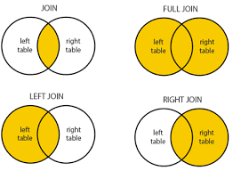
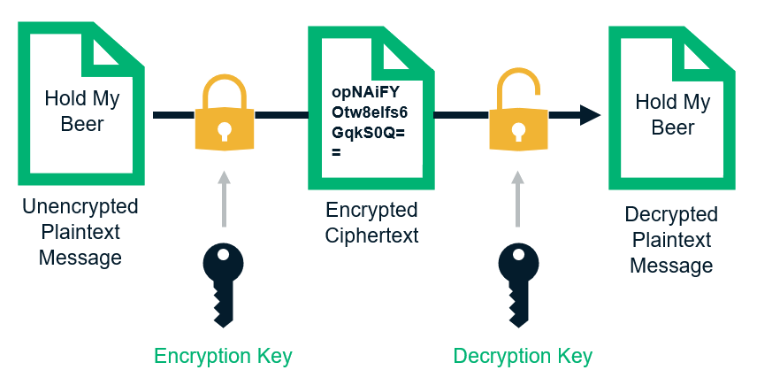

# Writing Test Week 6

## MySQL Basic

### **Database**

- Database merupakan sekumpulan tabel yang berisikan informasi untuk diolah yang kemudian data tersebut bisa digunakan di dalam sebuah sistem.
- Software untuk membuat database disebut DBMS (Database Management System).
- Tipe utama pada Database management System antara lain, Hierarchical, Network, Relational, Non Relational, and Object Oriented.
- Bagian bagian dalam Database :
  - Table : kumpulan value yang dibangun oleh baris dan kolom yang berisi atribut dari data.
  - Field : kolom dari sebuah tabel.
  - Record : kumpulan nilai yang saling terkait.

### **RDBMS**

- Relational Database Management System atau disingkat RDBMS adalah sistem database yang entitas utamanya terdiri dari tabel - tabel yang saling berelasi.
- Contoh RDBMS : Mysql, PostgreSQL, OracleDB, SQL Server SQLite.
- Relasi antartabel dihubungkan dengan _Primary key_ dan _Foreign key_.
- Relasi database ada 3, yaitu :
  - One to One
  - One to Many
  - Many to Many
- Join adalah penggabungan tabel yang dilakukan melalui kolom/key tertentu yang memiliki nilai terkait untuk mendapatkan satu set data dengan informasi lengkap.
- Gambaran dari Join :  
  
- Inner Join : menampilkan data hanya yang sesuai di kedua tabel.
- Left Join : menampilkan semua data sebelah kiri dari tabel yang di joinkan dan menampilkan data sebelah kanan yang cocok dengan kondisi join. Jika tidak ditemukan kecocokan, maka akan di set NULL.
- Right Join : menampilkan semua data sebelah kanan dari tabel yang di joinkan dan menampilkan data sebelah kiri yang cocok dengan kondisi join. Jika tidak ditemukan kecocokan, maka akan di set NULL.

### **MySQL**

- MySQL adalah sebuah RDBMS open-source yang berbasis pada SQL.
- Kelebihan MySQL :
  - Portabilitas, bisa berjalan di berbagai OS.
  - Open source, dapat digunakan secara gratis.
  - Multi user, dapat digunakan beberapa pengguna dalam waktu yang bersamaan tanpa konflik.
- Instalasi MySQL di windows bisa melalui : https://dev.mysql.com/downloads/installer.
- SQL atau Structured Query Language adalah bahasa yang digunakan untuk mengakses database seperti membuat, menampilkan, menghapus, dan memperbarui data dalam database.
- Tipe data di MySQL :
  - Number
  - String
  - Boolean
  - Date time
  - Null
  - Default
- Beberapa SQL Command :

1. Database Command

   - `SHOW DATABASES;` digunakan untuk menunjukkan seluruh list database di mysql kita.
   - `CREATE DATABASE nama_db;` digunakan untuk membuat database baru.
   - `USE nama_db;` digunakan untuk menggunakan database yang sudah ada.
   - `DROP DATABASES nama_db;` digunakan untuk menghapus database.

2. Table Command
   - `SHOW TABLES;` untuk melihat semua ini table di database.
   - `CREATE TABLE` untuk membuat table baru seperti:
     ```sql
         CREATE TABLE Persons (
         PersonID int,
         LastName varchar(255),
         FirstName varchar(255),
         Address varchar(255),
         City varchar(255)
         );
     ```
   - `DROP TABLES nama_db;` untuk menghapus table.
   - menambah atau menghilangkap kolom di table yang dipilih, kita bisa menggunakan `ALTER` dan menggunakan `ADD` untuk menambah kolom atau `DROP COLUMN` untuk menghapus kolom.
   - `SELECT * FROM nama_db;` untuk melihat semua isi table.
   - Dan masih banyak command lain.

## MySQL Lanjutan

Peserta mampu memahami dan melakukan manipulasi query tingkat lanjut yang sering digunakan
Peserta mampu memahami dan membuat relational antar table

- Relations di SQL
  - One to Many : paling sering digunakan, satu baris dalam tabel dapat memiliki beberapa baris di table relasinya.
  - Many to Many : Digunakan ketika kedua tabel yang berelasi dapat memiliki beberapa baris di tabel relasinya.
  - One to One : jarang digunakan, sama seperti One to Many tetapi dengan kondisi tambahan (foreign key merupakan primary key).
- Database Normalization : Merupakan teknik analisis data yang mengorganisasikan atribut-atribut data dengan cara mengelompokkan sehingga terbentuk entitas yang non-redundant, stabil, dan fleksible.
- Tujuan database Normalization :
  - Menghilangkan redundan data pada database.
  - Memudahkan juka ada perubahan struktur table database.
  - Memperkecil pengaruh jika ada perubahan dari struktur table database.
- Efek jika tidak melakukan Normalisasi Database :
  - INSERT Anomali
  - DELETE Anomali
  - UPDATE Anomali
- Bentuk Database Normalization :

1. 1NF (First Normal Form) :
   - Menghilangkan multiple value pada sebuah kolom table database
   - Sebuah table memenuhi kaidah 1NF jika :Setiap kolom bernilai tunggal (single value)
   - Setiap kolom memiliki nama yang unik
   - Urutan penyimpanan data tidak menjadi masalah
2. 2NF (Second Normal Form) :

   - Harus sudah dalam bentuk 1NF untuk mendapatkan 2NF
   - Menghapus beberapa subset data yang ada pada tabel dan menempatkan mereka pada tabel terpisah.

3. 3NF (Third Normal Form) :
   - Menghilangkan seluruh atribut atau field yang tidak berhubungan dengan primary key. Dengan demikian tidak ada ketergantungan transitif pada setiap kandidat key

## Authentication & Authorization

<!-- Peserta mampu memahami beberapa variasi authentication dan authorization
Peserta mampu memahami perbedaan authnentication, authorization, dan encryption
Peserta mampu membuat authentication dan authorization -->

### **Authentication**

- Authentication adalah verifikasi untuk mengetahui apakah seseorang sudah pernah login atau belum dalam suatu aplikasi atau web.

- Authentication bergantung pada 3 faktor, yaitu
  - Pengetahuan (Knowledge), yaitu username dan password.
  - Kepemilikan (Possession), seperti smartphone atau kartu ID.
  - Sesuatu tentang kita (Inherence), seperti sidik jari.
- Authentication yang bergantung pada satu faktor disebut Single Factor Authentication.
- Sementara itu, Authentication yang menggunakan dua atau lebih faktor disebut Multi-factor Authentication.

### **Authorization**

- Authorization adalah hak akses yang diberikan kepada seseorang setelah berhasil login ke dalam suatu aplikasi atau web.
- Authorization sangat penting untuk keamanan web, dan bertanggung jawab atas segala hal mulai dari mencegah pengguna memodifikasi akun, melindungi aset back-end dari hacker, dan memberikan akses terbatas ke layanan eksternal.
- Authorization yang baik memungkinkan Anda membatasi pengguna dan layanan untuk hak istimewa yang mereka butuhkan.
-

### **Encryption**

- Enkripsi adalah proses mengubah data menjadi format yang tidak dapat dibaca kecuali memiliki kunci yang benar untuk mendekripsinya.
- Ada dua jenis enskripsi. yaitu :

1. Enkripsi simetris
2. Enkkripsi asimetris

- Encryption adalah salah satu tools untuk menegakkan authentication dan authorization.
  

- Perbedaan utama antara Authentication, Authorization, dan Encryption adalah pada fungsinya, yaitu Authentication berguna untuk mengecek apakah seorang user sudah pernah login atau register, authorization berguna untuk memberikan batasan atau hak akses kepada user setelah berhasil login, dan ecnryption berguna untuk proses pertukaran data dimana data seperti plaintext diubah menjadi bentuk yang susah dibaca oleh orang lain dan hanya bisa dibaca oleh user yang memiliki private key(decrypt) sehingga data penting bisa terjaga kerahasiaannya.
- Contoh penerapan Authentication :

  ```javascript
  const express = require("express");
  const router = express.Router();
  const jwt = require("jsonwebtoken");

  const users = [
    { id: 1, email: "dollong@gmail.com", password: "123" },
    { id: 2, email: "kiki@gmail.com", password: "123" },
  ];

  const KEY = "asdfjsdaklf234234";

  // http://localhost:3000/auth/login
  router.post("/login", (req, res) => {
    const { email, password } = req.body;

    const userData = users.find((item) => email === item.email && password === item.password);

    const token = jwt.sign(
      {
        id: userData.id,
      },
      KEY
    );

    if (userData) {
      res.json({
        message: "success login",
        token,
      });
    } else {
      res.status(401).json({
        message: "email or password are incorrect",
      });
    }
  });

  // http://localhost:3000/auth/register
  router.post("/register", (req, res) => {
    res.json({
      message: "success regis",
    });
  });

  module.exports = router;
  ```

## Sequelize

<!-- Peserta mampu memahami dan menggunakan Sequalize
Peserta mampu membuat API Specification
Peserta mampu membuat web server dan RESTFul API -->

- Sequelize adalah ORM (Object Relational Mapping) Node JS yang berbasis promise. Sequelize mendukung sebagian besar relational Database seperti MySQL, PostgresQL, MariaDB, SQLite dan Miscrosoft SQL Server.
- Dengan fitur fitur di Sequelize, kita bisa mengelola dan mengatur data di database kita dengan cepat, dan efisien.
- ORM adalah suatu metode/teknik pemrograman yang digunakan untuk mengkonversi data dari lingkungan bahasa pemrograman berorientasi objek (OOP) dengan lingkungan database relational.
- Untuk melakukan Instalasi Sequelize, ada 2 cara, yaitu _without migration_ dan _with migration_.
- Pertama, kita perlu menginstal sequelize cli agar dapat menjalankan generator menggunakan terminal sehingga lebih mudah.
  `npm install -g sequelize-cli`
- Ketika kita melakukan inisiasi project kita pertama perlu menginstall sequelize menggunakan npm install sequelize dan perlu menginstall driver sql yang kita butuhkan.
  `npm install --save sequelize`
  `npm install --save mysql`
- Sequelize init untuk melakukan inisialisasi project agar dapat melakukan generate code.
  `npx sequelize-cli init`
- Generate Model
  `npx sequelize-cli db:migrate`
  `npx sequelize-cli db:migrate:undo` untuk membatalkan perubahan.
- Generate Seed
- Seed adalah data awal yang bisa kita gunakan untuk mengisi data di database untuk keperluan awal project menggunakan sequelize.
  `npx sequelize-cli seed:generate --name demo-db`
- Ketika sudah berhasil melakukan generate maka kita dapat melakukan pengisian data seed didalam file seed generator. Terdapat 2 data yang diisi yaitu “up” untuk mengisi data di db, dan “down” untuk drop atau menghapus semua data seed di db
- Jalankan Generate Seed menggunakan sequelize
  `npx sequelize-cli db:seed:all`
