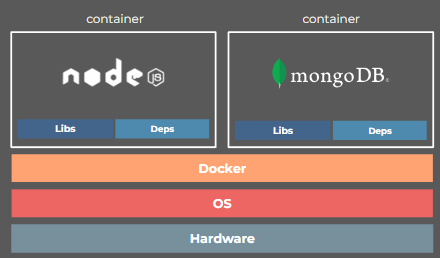
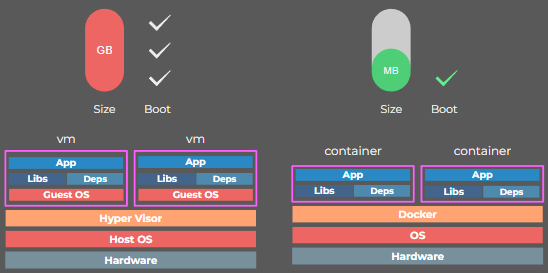

# Writing Test Week 7

## Sequelize

- Sequelize adalah ORM (Object Relational Mapping) NodeJS yang berbasis _promise_ dan mendukung Relational Database seperti MySQL, PostgresQL, MariaDB, SQLite, dan Microsoft SQL Server.
- Dengan fitur-fitur di Sequelize, kita bisa mengelola dan mengatur data di database dengan cepat dan efisien.
- ORM adalah suatu metode atau teknik pemrograman yang mengkonversi data dan lingkungan bahasa pemrograman berbasis Objek (OOP) dengan lingkungan database relasional.

### **Instalasi Sequelize**

- - Untuk melakukan Instalasi Sequelize, ada 2 cara, yaitu _without migration_ dan _with migration_.
- Pertama, kita perlu menginstal sequelize-cli agar dapat menjalankan generator menggunakan terminal dengan lebih mudah.
  `npm install -g sequelize-cli`
- Untuk inisiasi projek, install juga sequelize dan perlu menginstall driver sql yang kita butuhkan.
  `npm install --save sequelize`
  `npm install --save mysql`
- Sequelize init untuk melakukan inisialisasi project agar dapat melakukan generate code.
  `npx sequelize-cli init`
- Setting Database untuk mengkoneksikan database yang akan kita gunakan.
  ```javascript
  const Sequelize = require("sequelize");
  // Op 1 :
  const sequelize = new Sequelize("database", "username", "password", {
    host: "localhost",
    dialect: "mysql",
  });
  ```

### **Generate Model**

- `npx sequelize-cli model:generate --name <name_table> --attibutes <fields:dataType>`
- `npx sequelize-cli db:migrate` untuk melakukan generate.
- `npx sequelize-cli db:migrate:undo` untuk membatalkan perubahan jika terjadi kesalahan.
- Saat sudah berhasil dibuat, maka di database akan ada satu database baru yang dibuat tadi.

### **Generate Seed**

- Seed adalah data awal yang bisa kita gunakan untuk mengisi data di database untuk keperluan awal project menggunakan sequelize.
  `npx sequelize-cli seed:generate --name demo-db`
- Ketika sudah berhasil melakukan generate maka kita dapat melakukan pengisian data seed didalam file seed generator. Terdapat 2 data yang diisi yaitu “up” untuk mengisi data di db, dan “down” untuk drop atau menghapus semua data seed di db.
- Jalankan Generate Seed menggunakan sequelize
  `npx sequelize-cli db:seed:all`.
- Setelah dijalankan, maka akan ada data yang di insert dan seeding berhasil.

## MongoDB

- MongoDB adalah salah satu database open source NoSQL yang cukup populer digunakan.
- MongoDB sering dipakai untuk aplikasi berbasis CLoud, Big Data , maupun Computin.
- Mongo DB menyimpan dokumen dengan formay JSON.

### **No SQL**

- NoSQL adalah Not Only SQL, artinya kita bisa mengolah database dengan fleksibel dan tidak membutuhkan query.
- Kelebihan :
  1. Tidak membutuhkan tabel
  2. Tidak perlu menggunakan tabel yang terstruktur
  3. By Default sudah menggunakan JSON.
  4. Performa lebih cepat.
- Kekurangan :
  1. Tidak mendukung transaksi
  2. Masalah konsistensi data
  3. Menggunakan banyak memori
  4. Maksimal 16MB untuk setiap dokumen.
- Database adalah wadah untuk menyimpan berbagai macam Collection.
- Collection adalah kumpulan dari berbagai macam document.

### **Instalasi MongoDB**

- Untuk proses lengkap bisa akses di https://docs.mongodb.com/manual/administration/install-community/ .
- Untuk memudahkan, kita bisa menggunakan GUI Tools Official dari MongoDB yaitu MongoDB Compass.
- Link download : https://www.mongodb.com/products/compass

### **Operasi CRUD MongoDB**

- Secara default, database kita adalah "test".
- Command `db` untuk melihat database yang aktif saat ini.
- Command `show dbs` untuk melihat daftar database yang ada.
- Command `use nama_db` untuk membuat database baru.
- Command `db.createCollection("name"` untuk membuat collection baru.
- Command `db.artis.inser({attributes:value})` untuk menambahkan data baru ke Collection.
- Command `db.artis.find()` untuk melihat data.
- Command `db.artis.update({attribute:value},{$set:{newAtt:newVal}})` untuk mengupdate data pada Collection.

### **Cara mendesain schema MongoDB**

- Ada dua pendekatan yang dilakukan, yaitu Embedding dan Referencing.
- Embedding artinya memasukkan semua data yang terkait dalam satu dokumen.
- Referencing artinya memasukkan data sebagian saja dalam satu dokumen.

### **Relasi MongoDB**

- One-to-One : disarankan menggunakan Embedding.
- One-to-Many : disarankan menggunakan Reference
- Many-to-Many : disarankan menggunakan Reference.

## Mongoose

- Mongoose adalah _library_ yang bisa disebut Object Modelling MongoDB untuk NodeJs.
- Mongoose bisa digunakan untuk mengelola hubungan antara data, menyediakan validasi, dan menerjemahkan antara objek dalam kode dan representasi objek tersebut di MongoDB.
- Dokumentasi Mongoose bisa diakses melalui link berikut : https://mongoosejs.com/docs/index.html.

### **Instalasi Mongoose**

- Pastikan NodeJs dan MongoDB sudah terinstal, lalu ketikkan `npm install mongoose` untuk menginstal mongoose.
- Membuat koneksi dengan MongoDB database yang diletakkan di file `.env`.

  ```javascript
  const mongoose = require("mongoose");
  require("dotenv").config();
  const url = process.env.MONGOOSE_URL;

  mongoose.connect(url, {
    useNewUrlParser: true,
    useUnifiedTopology: true,
    useDindAndModify: false,
  });

  const db = mongoose.connection;
  db.on("error", console.error.bind(console, "connection error"));
  db.once("open", () => console.log("we are connected"));
  ```

### **Mendesain Schema**

- Untuk mendesain schema database denan mongoose, bisa dengan mendefine fields dan tipe datanya.

  ```javascript
  const Schema = mongoose.Schema;

  let userSchema = new Schema(
    {
      name: String,
      password: String,
      email: String,
      phone: String,
    },
    {
      timestamps: true,
    }
  );
  ```

- Untuk menambahkan validasi data, tambahkan `required : true` pada field yang membutuhkan.

### **CRUD dengan Mongoose**

- Untuk menampilka seluruh data (READ), gunakan function `find()`.
- Kita menggunakan method POST untuk mendaftarkan user, sebelum mendaftarkan kita mengecek dulu apakah user sudah ada atau belum dengan menggunakan `findOne()`, jika sudah ada akan muncul pesan error, jika belum terdaftar maka user akan didaftarkan menggunakan fungsi `create()`.
- Untuk mendapatkan data user berdasarkan id, gunakan fungsi `findById()`.
- Untuk menghapus satu data berdasarkan ID, gunakan fungsi `deleteOne()`.
- Untuk mengedit/update satu data berdasarkan ID, bisa menggunakan `findByIdAndUpdate()`.

### **Populate**

- Populate ada kaitannya dengan relasi database. Populate adalah proses penggabungan 2 collection atau lebih menjadi satu objek JSON.

## Docker

Memahami pengertian docker
Memahami pentingnya docker
Memahami konsep container
Memahami basic syntax docker terminal
Memahami Dockerfile
Memahami docker compose

- Docker adalah software yang menjalankan suatu aplikasi menggunakan container.
  
- Docker menmbagikan kernel dari host OS, serta meng-container-kan suatu aplikasi agar dapat dijalankan dimana saja dan kapan saja
- Aplikasi yg berjalan di dalam container docker tidak terpengaruh oleh faktor luar karena terisolasi
- Docker berfungsi sebagai penyedia layanan virtual bagi aplikasi yg diinstall pada sebuah host.
- Docker akan menyediakan hal-hal yang diperlukan untuk aplikasi mulai dari akses file, koneksi internet, hingga port agar aplikasi dapat berjalan dengan mulus
- Container vs Virtual Machine
  
- VM memakan banyak resource dan waktu utk booting karena melakukan virtualisasi pada host hardware-nya.
- Sedangkan container kebalikannya dari vm, container melakukan virtualisasi pada host OS-nya

### **Docker Fundamental**

- **Docker File** : Blueprint untuk membuat image.
- **Image** : Template untuk menjalankan container.
- **Container** : Perwujudan dari image
- **Docker Registry** : Template untuk upload / download image.
- **Docker Compose**: Cara untuk menjalankan lebih dari 1 container secara bersamaan dan saling terhubung

### **Instalasi Docker**

- Link : [docs.docker.com/get-docker](docs.docker.com/get-docker)
-

### **Perintah Dasar**

- `docker pull` : download image dari docker hub.
- `docker images` : melihat kumpulan images yang sudah terdownload.
- `docker run` : menjalankan container.
- `docker ps` : melihat container yang berjalan
